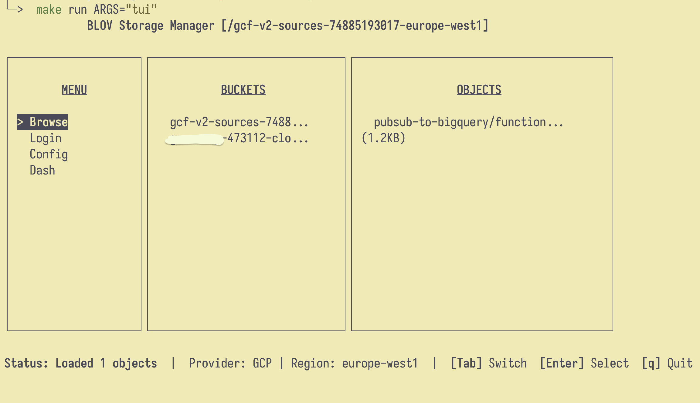

### blov - CLI/TUI for managing blob storages (s3, gcs, azure blob) across different CSPs 

WIP - GCP 
```bash config      Manages the config of each provider: region and project-id (or equivalent)
  help        Help about any command
  login       Login to the chosen provider.
  storage     Command for handling storage (buckets)
  tui         Launch interactive TUI interface

```


TUI: 
